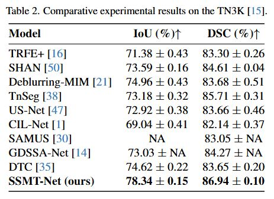
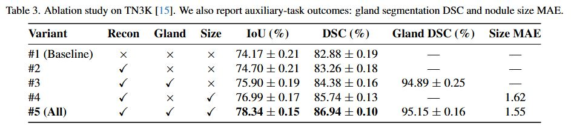
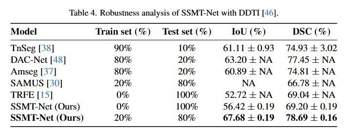

# [SSMT-Net: Semi-Supervised Multitask Transformer-Based Network for Thyroid Nodule Segmentation in Ultrasound Images](#)

# SSMT-Net Overview

# Ambiguous and low-contrast thyroid nodule cases in ultrasound imaging

# Comparison with recent thyroid nodule segmentation approaches

# Comparative experimental results on the TN3K 

# Ablation study

# Robustness analysis with DDT

